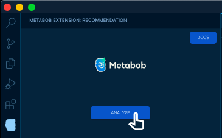
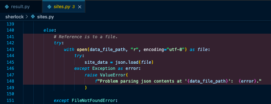
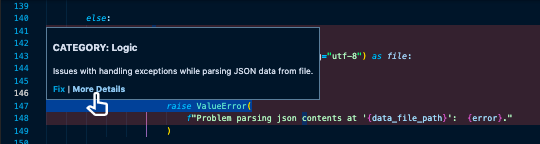
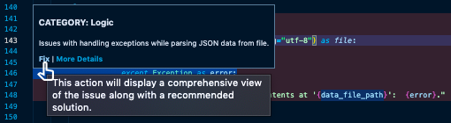
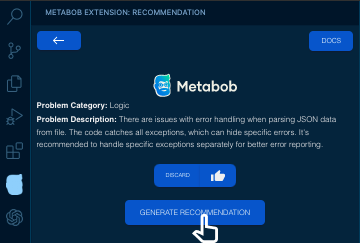
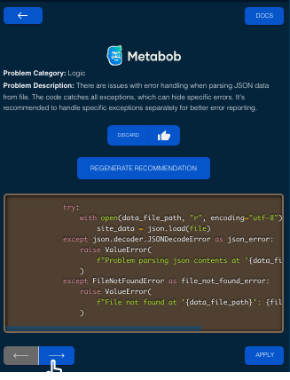
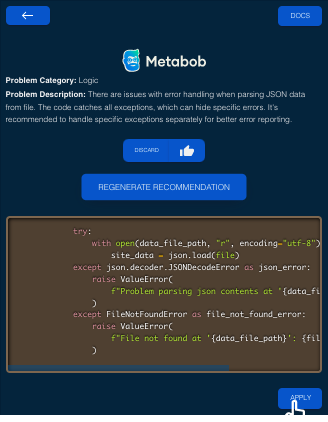

# Metabob: Generative AI for debugging & refactoring code

Metabob is an AI-based code review tool that utilizes a combination of Graph Neural Networks (GNNs) and Generative AI (LLMs).  Using the underlying techniques, Metabob can detect complex logical problems and vulnerabilities, as well as general opportunities for code quality improvements. Metabob explains its detections in natural language and can generate code recommendations to fix the detections using an integrated fine-tuned LLM. 
​
# Supported Languages
* Python
* JavaScript
* TypeScript
* C
* C++
* Java

# AI Code Review
* Automatically detect problems, vulnerabilities, and code optimization opportunities
* View natural language explanations for the detected problems
* Generate code recommendations to fix the detected problems
* Give feedback on the detections to optimize model performance (discard, endorse)

# Features
* Problem, vulnerability & code optimization detection
* Detection explanations
* LLM interaction: generate code recommendations
​​
# Settings​

* To disable Metabob anlaysis from running every time code is saved, go to the extension settings and deselect the checkbox under the text "Metabob: **Analyze Document On Save**"  

​
* To change the backend LLM model Metabob uses to generate problem descriptions and code recommendations, select your preferred model from the "Metabob: **Backend Selection**" drop down menu

​
* If you prefer to use one of the openai models, you need to authenticate by inputting your openai API key into the text field under "Metabob: ChatGPT Token" text field on Metabob's extension settings 

# Usage​
​
1. Request an analysis

Users can request Metabob to analyze the file they are currently working on by:
* Using the "**ANALYZE**" -button on the Metabob extension side panel

* Opening the command palette and using the command "**Metabob: Analyze Document**"

* Saving the file (requires "**Analyze Document On Save**" to be enabled on the extension settings

Users can confirm that the Metabob Analysis is running by seeing a loading icon next to a text "Metabob: Analyzing Document" on the bottom left corner of the VS Code editor.

Once the analysis has finished, users can see problematic areas highlighted in red on the file they are currently viewing and requested analysis for from Metabob.

2. View problem details

Users can view problem details by hovering over the red highlighted problem regions in their code and clicking "**More Details**"

​

3. Generate code recommendations to fix detected problems

Users can generate code recommendations to fix the detected problems by:
* Hovering over the red highlighted problem regions in their and clicking "**Fix**"

* Clicking the "**GENERATE RECOMMENDATION**" -button on the Metabob extension side panel when viewing problem details

If users think that the generated code recommendation is not correct, they can generate another recommendation by using the "**REGENERATE**" -button

Users can view the different generated code recommendations they have asked to generate by using the arrows below the code generated code recommendation

Users can apply the generated code recommendations to their code by clicking the "APPLY" -button

​

# Data Policy
​
Metabob deletes all data from it's problem detection model one hour after the user has made their last API call. However, as Metabob integrates with third party LLMs to generate problem descriptions and code recommendations to perform fixes, Metabob has to pass data to these models and cannot control how the data is used by the companies hosting these LLMs. ​
​

